# Connes-Weil RH Formalization

<p align="center">
  <a href="lean-toolchain"></a>
  <a href="lakefile.toml"></a>
</p>

This repository develops a Lean 4 formalization of analytic and
operator-theoretic ingredients in the Connes--Weil approach to the Riemann
hypothesis. It keeps four kinds of evidence distinct: theorems checked by the
Lean kernel, assumptions still needed by the route, results taken from the
literature, and numerical experiments used only as diagnostics.

The mathematical question is the [Riemann Hypothesis (RH)](https://github.com/leanprover-community/mathlib4/blob/master/Mathlib/NumberTheory/LSeries/RiemannZeta.lean).
The Riemann zeta function has trivial zeros at the negative even integers; its
other zeros in the critical strip are the nontrivial zeros. RH asserts that
every such zero lies on the critical line:

<br>

$$
\boxed{
\begin{aligned}
\mathrm{RH}:&\quad
\forall s\in\mathbb{C},\quad
\bigl(\zeta(s)=0\ \land\ 0<\mathrm{Re}(s)<1\bigr)\\
&\qquad\Longrightarrow\quad \mathrm{Re}(s)=\frac12.
\end{aligned}
}
$$

<br>

The labels used throughout the project are:

1. **Lean theorems:** propositions checked by the Lean kernel.
2. **Route assumptions:** explicit premises required by the output theorem.
3. **Literature results:** formulas and conventions quoted from published sources.
4. **Numerical diagnostics:** finite-precision experiments for testing candidates;
   they are not proofs.

## Status

> [!IMPORTANT]
> The Riemann hypothesis is **not proved** here. The output skeleton still
> contains five explicit project axioms, listed in
> RhOutputAxiomLedger.lean (ConnesWeilRH/Dev/RhOutputAxiomLedger.lean).
> The Lean results below are checked implications with visible premises; they
> do not silently discharge those premises.

## 1. The mathematical spine

The formal route tests this statement with a compactly supported function g and
its Hermitian convolution square. Four displays carry the route: the Euler
product, the square, the explicit formula, and the positivity criterion.

**The prime side.** The primes enter through the Euler product and the
logarithmic derivative of zeta:

<br>

$$
\boxed{
\zeta(s)=\sum_{n\ge1}\frac{1}{n^{s}}
=\prod_{p}\frac{1}{1-p^{-s}},
\qquad
-\frac{\zeta'}{\zeta}(s)=\sum_{n\ge1}\frac{\Lambda(n)}{n^{s}}
\qquad\bigl(\mathrm{Re}\,s>1\bigr)
}
$$

<br>

The coefficient $\Lambda(n)$ is the same von Mangoldt weight that the Lean
prime term uses
[verbatim](ConnesWeilRH/Dev/C1SameOwnerWeil.lean#L36).

**The square.** In multiplicative coordinates, the relevant identities are:

<br>

$$
\boxed{
\begin{aligned}
g^{\sharp}(x)&=x^{-1}\overline{g(x^{-1})},\\
F_g&=g\ast g^{\sharp},\\
\widetilde F_g(s)&=\widetilde g(s)\widetilde g(1-s),\\
\widetilde F_g\left(\frac12+it\right)
  &=\left|\widetilde g\left(\frac12+it\right)\right|^2.
\end{aligned}
}
$$

<br>

The last line is the square mechanism: on the critical line, the zero-side
contribution is termwise nonnegative. The product convention is derived in
[proof 1070](docs/proofs/1070_weil_q_hunting_level1.md), rather than assumed.

**The explicit formula.** For the square $F_g$, the Weil explicit formula,
pinned line-by-line from CC20 in
[proof 1070](docs/proofs/1070_weil_q_hunting_level1.md), puts the zeta zeros
on one side and the archimedean and prime contributions on the other:

<br>

$$
\boxed{
\begin{aligned}
\sum_{\zeta(\rho)=0}\widetilde F_g(\rho)
&=\underbrace{\widetilde F_g(1)+\widetilde F_g(0)}_{\text{trivial side}}
-\underbrace{W_{\mathbb{R}}(F_g)}_{\text{archimedean}}
-\underbrace{\sum_{p}W_p(F_g)}_{\text{primes}},\\
W_p(F_g)
&=\log p\sum_{m\ge1}
  \Bigl(F_g\bigl(p^{m}\bigr)+F_g^{\sharp}\bigl(p^{m}\bigr)\Bigr),\\
W_{\mathbb{R}}(F_g)
&=\bigl(\log 4\pi+\gamma\bigr)F_g(1)\\
&\quad+\mathrm{pv}\int_1^{\infty}
\frac{F_g(x)+F_g^{\sharp}(x)-2x^{-1}F_g(1)}{x-x^{-1}}\,dx.
\end{aligned}
}
$$

<br>

When every zero lies on the critical line, each conjugate pair
$\rho=\frac12\pm i\gamma$ contributes
$2\bigl|\widetilde g\bigl(\frac12+i\gamma\bigr)\bigr|^{2}\ge 0$
to the left-hand side, and no admissible $g$ can push the sum below zero.
A single off-line zero $\rho=\beta+i\gamma$ replaces that pair by the
quadruple $\{\beta\pm i\gamma,\,(1-\beta)\pm i\gamma\}$, whose contribution
has no fixed sign. On the repository's vanishing class the trivial side is
identically zero, so the criterion collapses to the Yoshida--CC20 positivity
form:

<br>

$$
\boxed{
\mathrm{RH}\ \Longleftrightarrow\
W_{\mathbb{R}}(F_g)+\sum_{p}W_p(F_g)\le 0
\quad\text{for every admissible }g
}
$$

<br>

The repository realizes the negated display, with the pole readback added
back, as $q_w(g)=\mathrm{poleTerm}-\mathrm{archimedeanTerm}
-\mathrm{finitePrimeSum}$ in additive coordinates; on the triple-vanishing
class the pole term is already zero. Section 2 shows the spectral readback
of the same value.

**The Lean owner.** The Lean owner uses the additive logarithmic coordinate.
Its involution and square are:

<br>

$$
\boxed{
\begin{aligned}
g^{\star}(x)&=\overline{g(-x)},\\
F_g&=g^{\star}\ast g,\\
F_g&=\texttt{g.involution.convolution g}.
\end{aligned}
}
$$

<br>

The implementation is
[CompactLogTest.convolutionSquare](ConnesWeilRH/Source/CCM25Concrete/CompactLogConvolution.lean#L114).
This owner is retained through the coordinate, convolution, arithmetic, trace,
and detector layers.

## 2. One quadratic form, two signs

The same-owner Weil value has both an arithmetic and a spectral description:

<br>

$$
\boxed{
\begin{aligned}
q_w(g)
  &=\mathrm{poleTerm}(F_g)\\
  &\quad-\mathrm{archimedeanTerm}(F_g)\\
  &\quad-\mathrm{finitePrimeSum}(F_g),\\
q_w(g)
  &=\mathrm{spectralWeilValue}(F_g).
\end{aligned}
}
$$

<br>

The first line is the component decomposition. The second is the completed
center-2 contour readback, proved by
[centerTwo_arithmetic_eq_spectral](ConnesWeilRH/Dev/C1XiCenterTwoArithmeticAssembly.lean#L232)
and used by
[qw_eq_spectralWeilValue_centerTwo](ConnesWeilRH/Dev/C1CenterTwoCriterionBridge.lean#L28).

After assuming a zero off the critical line, the live proof has one owner and
two obligations:

~~~text
                         hypothetical off-line zero rho
                                      |
                 +--------------------+--------------------+
                 |                                         |
                 v                                         v
      construct one healthy CompactLogTest g       prove positivity for the
      with detector data from rho                   same g and its visible
                 |                                  prime-power set
                 v                                         |
              q_w(g) < 0                                  q_w(g) >= 0
                 |                                         |
                 +--------------------+--------------------+
                                      |
                                      v
                               contradiction
                                      |
                                      v
                         SourceRH  ->  Mathlib RH
~~~

The negative sign is formal. The positive sign is the open C3 theorem. The
minimal contradiction is therefore:

<br>

$$
\boxed{
\begin{aligned}
q_w(g)&<0,\\
0&\le q_w(g),\\
\therefore\quad&\bot.
\end{aligned}
}
$$

<br>

This is a same-test contradiction, not an all-test positivity claim.

## 3. Lean Formalization

The Lean layer is organized as an auditable architecture for the Connes--Weil
route: one typed owner carries the test and its square, each analytic step is
an explicit contract, and every frontier leaf has an axiom audit. Each item
below pairs one declaration with the mathematical relation it exposes. The
links point to the owning Lean lines; they do not claim that the open analytic
producer has already been proved.

**1. Same-owner arithmetic and spectral values: `centerTwo_arithmetic_eq_spectral`**

The same `CompactLogTest` is read in both languages:

<br>

$$
\boxed{
\begin{aligned}
\psi_{\mathrm{arith}}(F)&=\psi_{\mathrm{spec}}(F),\\
&\qquad F:\mathrm{CompactLogTest}.
\end{aligned}
}
$$

<br>

Evidence: [C1XiCenterTwoArithmeticAssembly.lean#L232](ConnesWeilRH/Dev/C1XiCenterTwoArithmeticAssembly.lean#L232).

**2. Healthy detector from a right-oriented zero: `exists_healthyDetectorData_of_sourceNontrivialZero_right`**

A hypothetical zero to the right of the critical line supplies one detector package:

<br>

$$
\boxed{
\begin{aligned}
\rho\in\mathrm{sourceNontrivialZeroSet},\quad
\frac12<\mathrm{Re}(\rho),\quad
\mathrm{Re}(\rho)\ne\frac12\\
&\Longrightarrow\exists g:\mathrm{CompactLogTest},\;
  \mathrm{HealthyYoshidaDetectorData}(\rho,g).
\end{aligned}
}
$$

<br>

Evidence: [C1HealthyYoshidaSpectralNegativity.lean#L511](ConnesWeilRH/Dev/C1HealthyYoshidaSpectralNegativity.lean#L511).

**3. ROOT endpoint consumer: `qw_nonneg_of_cc20EndpointTraceCertificate_of_rootSupport_logTwoHalf`**

The endpoint certificate is a separate input, while the sign conclusion belongs to the same owner:

<br>

$$
\boxed{
\begin{aligned}
\mathrm{Vanishes}(g)&\land
  \mathrm{supp}(g)\subseteq
    \left[-\frac{\log 2}{2},\frac{\log 2}{2}\right]\\
&\land\mathrm{EndpointCertificate}(g)
  \Longrightarrow q_w(g)\ge 0.
\end{aligned}
}
$$

<br>

Evidence: [C1CC20ArchimedeanReadback.lean#L133](ConnesWeilRH/Dev/C1CC20ArchimedeanReadback.lean#L133).

**4. Selected semi-local residual: `projectionResponse_eq_selectedEulerBoundary_add_residual`**

The selected detector keeps the visible Euler boundary and the remaining
projection residual as separate terms:

<br>

$$
\boxed{
\begin{aligned}
\mathrm{ProjectionResponse}(g)&=
  \mathrm{VisibleEulerBoundary}(g)+\mathrm{Residual}(g),\\
\mathrm{Vanishes}(g)\land
  \text{sign certificate}(g)&\Longrightarrow q_w(g)\ge 0.
\end{aligned}
}
$$

<br>

Evidence: [C1SelectedDetectorSemiLocalResidual.lean#L79](ConnesWeilRH/Dev/C1SelectedDetectorSemiLocalResidual.lean#L79).

**5. Support and visible-prime ownership: `support_subset_Icc` and `mem_globalPrimeIndexSet_iff`**

The same `CompactLogTest` owns both its support radius and its finite
visible prime-power set:

<br>

$$
\boxed{
\begin{aligned}
\mathrm{supp}(F.test)&\subseteq[-R_F,R_F],\\
n\in\mathrm{globalPrimeIndexSet}(F)&\Longleftrightarrow
  \mathrm{IsPrimePow}(n)\land
  \mathrm{finitePrimeTermComplex}(F,n)\ne 0.
\end{aligned}
}
$$

<br>

Evidence: [C1SameOwnerWeil.lean#L77](ConnesWeilRH/Dev/C1SameOwnerWeil.lean#L77) and [C1SameOwnerWeil.lean#L149](ConnesWeilRH/Dev/C1SameOwnerWeil.lean#L149).

**6. Minimal B5 exit: `healthy_sourceRH_of_right_detector_specific_qw_nonneg`**

One nonnegative value for the detector selected against each right-hand zero is enough for the logical exit:

<br>

$$
\boxed{
\begin{aligned}
\mathrm{B5}_{\mathrm{detector}}:&\quad
  \forall\rho,\quad
  \mathrm{Re}(\rho)>\frac12\Longrightarrow\exists g,\\
&\qquad \mathrm{Healthy}(\rho,g)\land q_w(g)\ge 0,\\
\mathrm{B5}:&\quad
  \mathrm{B5}_{\mathrm{detector}}\Longrightarrow \mathrm{SourceRH}.
\end{aligned}
}
$$

<br>

Evidence: [C1HealthyYoshidaSpectralNegativity.lean#L554](ConnesWeilRH/Dev/C1HealthyYoshidaSpectralNegativity.lean#L554).

**7. Prime-power trace readback: `eulerLog_weighted_pair_traces_eq_finitePrimeTerm_pow`**

A paired crossing trace carries the exact finite-prime coefficient:

<br>

$$
\boxed{
\frac{1}{m\sqrt{p^m}}
\left(\mathrm{Tr}\,K_{p^m}+\mathrm{Tr}\,K_{p^m}^{\mathrm{rev}}\right)
=W_{p^m}(F_g).
}
$$

<br>

Evidence: [SelectedCrossingKernel.lean#L390](ConnesWeilRH/Source/CCM25Concrete/SelectedCrossingKernel.lean#L390).

**8. Normalized-socket rejection: `not_normalizedCC20MellinConvolutionLaw`**

The old additive socket doubles a Mellin value, so it cannot be the Weil square:

<br>

$$
\boxed{
\widetilde g(z)=1,\qquad
\widetilde{g\star_{\mathrm{add}}g}(z)=2
\ne 1=\widetilde g(z)\widetilde g(1-z).
}
$$

<br>

Evidence: [CC20YoshidaConstruction.lean#L2727](ConnesWeilRH/Source/CC20YoshidaConstruction.lean#L2727).

## 4. Current progress: selected-owner B5 route

This section records the current healthy-`CompactLog` B5 mainline. RH is not
claimed. The formal consumer is:

```text
selected detector with qw < 0
  -> same-owner semi-local proof of qw >= 0
  -> SourceRH
  -> Mathlib RiemannHypothesis.
```

For a hypothetical right-hand off-line zero, Lean now constructs the selected
healthy orbit detector, its support-derived finite visible-prime owner, triple
vanishing, and strict spectral negativity. ROOT-window positivity remains only
a shared local base: no theorem transfers it to this orbit-scale owner.

| Route | Current status |
| :-- | :-- |
| B1 universal positivity | Frozen; no density or partition lift is available |
| B5 selected-owner positivity | Active mainline |
| ROOT/CC20 endpoint package | Local infrastructure; endpoint certificate remains open |
| Same-owner semi-local gate | The single RH-critical producer obligation |

### Latest route progress

Route A now has an exact selected-owner expansion: the finite prime term is
the actual support-derived visible profile, not an opaque input. Its paired
Lean audit completed successfully with standard axioms and no `sorryAx`
([proof record 1922](docs/proofs/1922_route_a_round1_selected_owner_readback.md)).

The next step added a physical-derivative-controlled correction and an exact
coboundary reduction, while keeping the complete finite-prime aggregate
grouped. The remaining signed inequality is now precisely
`archimedeanTerm + integral(actualAggregate) <= -epsilon`. The current
classical selector cannot provide a uniform bound tying its derivative cost to
the interpolation data, so the final signed margin remains open; this is a
scoped selector no-go, not a no-go for future variational selectors
([records 1924-1926](docs/proofs/1924_route_a_physical_derivative_selector.md)).

The variational replacement has a formal minimum-norm finite-basis core and
formal source derivative transport. Its remaining obligation is a
source-specific weighted minimization with a uniform signed physical-kernel
margin ([records 1927-1930](docs/proofs/1927_variational_min_norm_affine_selector.md)).

The current Route-A continuation keeps the actual source owner and splits its
weighted zero mass by exact dyadic height shells. Records 2186-2194 formalize
the shell partition, multiplicity-preserving summability, and a high-shell
budget. The first global coefficient-triangle screen failed, so that shortcut
is frozen (2196). The owner-local direct-product screen then reduced the
high-shell budget to `3.691e9`, or `0.002203` of the candidate signed margin
(2197). The numerical terminal now carries directed-MPFR q-interval
certificates: the corrected complex-weight evaluator was extended to all 30
owner nodes with outward charge accumulation (2229, binding node 2 at
`8.792971355816406e-09`, zero interval failures), the discrete-defined
operand convention and the complete owner-transfer obstruction list are
recorded (2230), and the uniform charge prices at `1.4069e-04` of the
`6.2550323e-05` correction target, `2.7956x` below the parameterized
assembly (2231). The next batch closes the accumulation side of the operand
gate (2232 family stitch, no deficits; 2233 ledger: c-radius `1.1e-05`
relative, weights screened at `9.2e-14`, one-ulp node displacement `+15.2%`
at the binding node, about `2.1e-05` of the target) and opens the first gap
of the low-shell side: the direct-product screen is re-evaluated as an
outward MPFR enclosure (2234), the too-loose envelope is attributed to a
coefficient radius charging the generation and solve channels together
(2235), and charging the computed solve floor makes the enclosure viable,
`tail/margin = 0.0774` with `12.9x` headroom (2236). The 2237-2241
batch then retires two of those gates and isolates the rest: the generation
channel becomes a certified per-entry MPFR enclosure at `3.97e-05` of its
screen (2237, `delta_max 9.49e-29`), the panel is repriced by the `dx^2`
composite-trapezoid law on measured zero-free cells to `tail/margin =
0.0355` with `28.1x` headroom (2238), the x-channel ledger covers all 30
nodes bitwise (2239), the multiplicity constant is verified as the Lean
formal constant, bitwise at `301.83032993648527` (2240), and the transfer
re-check reads the 2119 cardinality ratio at `1.721x` over the margin,
flipped to `0.530x` by the registered composite-EM panel lever (`3.248x`,
pending a certified zero count; 2241). The 2242-2244 batch then closes
those two numeric gates: the zero count `Z = 0` is certified for all four
channel functions by a directed 256-bit MPFR interval pavement plus an
analytic edge-arc certificate (2242: `8780 / 9247 / 21219 / 12500` boxes,
zero failures, floors `1.28e-63 ... 1.06e-53`; the `~5e-314` denormal
candidates at `+-2.5079` are the phi tail, bypassed analytically), the
composite-EM panel lands on that certificate (2243: `C_upper =
240796.76135588222`, `tail/margin = 0.006850392090059914`, `146x`
headroom, `5.19x` over the 2238 standing), and the transfer ledger is
re-inventoried (2244). The 2245-2248 batch then executes the registered
open items: the owner count is bricked explicitly (`N(T) = (theta(T) +
Phi(T))/pi` with the cited Trudgian `|S(T)|` bound: `<= 26 / 29 / 32`
unconditional, `= 21 / 24 / 27` under the Platt-Trudgian import at the
three stress candidates; the 2119 count ratio drops `48.43x -> 0.419x`
or `0.339x`, 2245, with an instrument finding that the 1980 kill list's
`27.67032193035704` is not a zeta zero), the 2157 separation input is
measured (`1.72 / 1.28 / 2.38` minimum target-to-pin, floors
`3.08e-3 / 4.13e-3 / 2.23e-3`, 2247), the item-5 strict-margin statement
is fixed with its ledger (`0.0012695277646158757` unconditional /
`0.0010339508223067488` imported, slack `~0.9987`; 2246), and the Lean
multiplicity constant is tightened (`192 -> 72`, the exact rung supremum:
`spectralMultiplicityConstant = 128.70692502980964`, high-shell
`tail/margin = 0.0029211540846331738`, module/probe/full-library builds
green; 2248). The 2249-2252 batch then closes `L1` and upgrades the other
two: the finite-window functional is enclosed by a first-order
forward-error shadow (`E_total = 1281535.3012791811`, `7.65e-7` of `|q|`,
certified margin `1675396046388.2737`; readings `0.0012695287356749262` /
`0.0010339516131735035`, `eps0 ~ 1.673e12`; cross-checks at `3.06e-13`
on the `g` peak and `3.55e-15` on the kernel; 2249), the count brick goes
per node (worst window count `<= 8` unconditional / `<= 2` enumerated,
against the ball-window `26 / 21`; 2250), the 2247 separations are
certified by 21 Hardy-Z brackets with a local uniform-in-`rho` lemma
(radius `0.18587152073670352`, separation `>= 1.3529256614271667`,
floor `>= 0.0015137680096211589`; 2251), and the item-5 arithmetic is
formalized in Lean (four `norm_num` theorems, axiom audit clean,
module/probe `3521` jobs and full library `4148` jobs green; 2252). This
is still a `GO-CANDIDATE / PARTIALLY PRICED`, not a producer: the
remaining obligations are the per-node charge uniformity half of the
transfer (per-node charge `<= tail/62`), global uniformity-in-`rho` of
the separation, and the registered ideal-to-discrete gaps of the `L1`
enclosure.

```mermaid
flowchart LR
    A[Hypothetical off-line zero] --> B[Healthy CompactLog detector]
    B --> C[Actual sourceNontrivialZeroSet owner]
    C --> D[Exact dyadic height shells]
    D --> E[High-shell weighted mass]
    E --> F{Direct-product C3' budget}
    F -->|2196: triangle bound fails| X[Freeze shortcut]
    F -->|2197-2200: 0.002203 margin ratio| G[GO-CANDIDATE]
    G --> H[Outward interval enclosure]
    H -->|2229-2231: 30-node MPFR envelope| H2[Interval terminal priced]
    H2 -->|2234-2252: outward B_zm viable, L1 enclosed, Z=0, counts per node| H3[Low shell + owner transfer]
    H3 --> J[Same-owner qw >= 0]
    J --> K[SourceRH]
    K --> L[Mathlib RH]
```



The graph has three open doors after the current candidate: (1) intervalize
the direct-product functions and solve error (the q-construction exponent
channel is outward-certified through 2229-2231 with the ledger priced by
2233/2239, the direct-product solve channel by 2234-2236, and the
operand-generation channel by 2237), (2) certify the low-frequency shell
without importing a finite list of numerical zeros (the registered 2238
composite-EM lever: a certified zero count replacing the global panel
majorants; closed by 2242-2243, the shell now reads `tail/margin =
0.0029211540846331738` after the 2248 Lean tightening), and (3) transfer
the resulting bound to the complete actual owner (the count side is
bricked at `<= 26` unconditional / `= 21` imported, 2245, per node
`<= 8 / <= 2` at the 30 construction nodes, 2250, so the coarse product
reads `0.00122500010000746` / `0.000989423157698333`; the per-node
CHARGE uniformity half remains open). RH is not claimed.

An alternative four-point same-owner span has formal finite-prefix and gate
algebra. Its live analytic obligation is the strict scored cross-determinant
inequality, equivalently an explicit signed-variance/five-moment inequality,
together with the joint tail margin. The current evidence is numerical
scouting only; the selected-owner gate is not proved
([map record 103](docs/map/103_four_point_same_span_three_cut_campaign.md)).

Accordingly, the project has made formal and quantitative reductions, but the
detector-specific positivity producer is still open. No current result claims
the Riemann hypothesis.

The binding route ruling is [record 1076](docs/map/003_b1_b5_minimal_exit_route_selection.md);
the active campaign is [Route A](docs/map/104_route_a_four_round_campaign.md).

## 5. Frozen and deferred routes

The project keeps failed or superseded routes visible so that a local lemma is
not mistaken for the current RH strategy.

| Route | Status | Failure mechanism or boundary | Evidence |
| :-- | :-- | :-- | :-- |
| Universal B1 globalization | Frozen | ROOT positivity does not control mixed terms or newly visible prime powers for arbitrary long-support tests | [route ruling 1076](docs/map/003_b1_b5_minimal_exit_route_selection.md) |
| Normalized additive B5 socket | Audit-only; no new producer work | Its old additive convolution violates the Mellin product law | [not_normalizedCC20MellinConvolutionLaw](ConnesWeilRH/Source/CC20YoshidaConstruction.lean#L2727) |
| Gate 3U and Lane R | Archived | Physical finite-band and prefix/tail sign experiments do not supply global spectral nonnegativity | [RH_MAINLINE_FREEZE.md](RH_MAINLINE_FREEZE.md) |
| Nyman--Beurling / Mobius blocks | Historical obstruction | The projected energy retains the inverse Gram matrix G_N^{-1} | [proof 020](docs/proofs/020_nyman_mobius_m4_first_verdict.md) |
| Titchmarsh square-form bridge | Deliberately deferred | A formal reverse support theorem needs Paley--Wiener / Cartwright machinery not present in Mathlib | [architecture record 1043](docs/map/001_first_cut_window_architecture.md) |
| External [-0.8,0.8] compact-window candidate for the D1 orbit | Blocked for this detector family | The selected detector still needs a support-compatible semi-local bridge | [map 004](docs/map/004_endpoint_literature_interface_audit.md), [record 1087](docs/proofs/1087_c3_root_window_spectral_verdict.md) |

### 5.1 The normalized-socket guard

The obstruction is a concrete Lean counterexample, not a naming preference. A
finite-window interpolant is chosen with Mellin value one:

<br>

$$
\boxed{
\begin{aligned}
\widetilde g(z)&=1,\\
\widetilde{g\star_{\mathrm{add}}g}(z)&=2,\\
2&\ne 1
  =\widetilde g(z)\widetilde g(1-z).
\end{aligned}
}
$$

<br>

The exact witness and contradiction are implemented by
[not_normalizedCC20MellinConvolutionLaw](ConnesWeilRH/Source/CC20YoshidaConstruction.lean#L2727).
The healthy owner uses the genuine convolution square shown in Section 1.

### 5.2 The inverse-Gram boundary

The Nyman--Beurling/Mobius line was not rejected because its finite matrices
are uninteresting. Its projection step keeps the hard inverse:

<br>

$$
\boxed{
\|w_N\|^2
  =a_N^{\mathsf T}
    \left(B_N-C_N^{\mathsf T}G_N^{-1}C_N\right)a_N
}
$$

<br>

Any proposed cancellation must control the projected Schur complement, not only
an unprojected Mobius sum. This is the structural conclusion of
[proof 020](docs/proofs/020_nyman_mobius_m4_first_verdict.md).

### 5.3 The prolate parameter boundary

The landed Bessel estimate has a precise scope:

<br>

$$
\boxed{
q_T(\xi)\ge(1-\lambda)\|\xi\|^2
\quad(\lambda<1),
\qquad
\lambda_{\mathrm{paper}}\simeq1.05158>1.
}
$$

<br>

It is a valid lambda < 1 side branch, not a paper-scale endpoint proof.
The required exceptional direction, complement bound, and rank-one repair are
recorded in
[route record 1050](docs/map/002_one_shot_rh_route_verdict.md).

## 6. Verification

Formal claims follow this chain:

~~~text
source formula or theorem
          |
          v
exact project definition and convention bridge
          |
          v
Lean declaration
          |
          v
focused #print axioms audit
          |
          v
build log with a success footer and no error lines
~~~

The imported source tree can be built with:

~~~bash
lake build ConnesWeilRH
~~~

Research-frontier modules under ConnesWeilRH/Dev/ are not all imported by the
root aggregate. Build a leaf together with its paired audit module and inspect
the log; the repository's WSL resource-admission procedure is documented in
[RESOURCE_SCHEDULING.md](RESOURCE_SCHEDULING.md).

Numerical files under docs/proofs/ generate candidates and diagnostics.
Floating-point eigenvalues are not treated as proofs of an
infinite-dimensional sign.

## 7. Sources and repository map

The repository uses several source layers. A citation below records the role of
the source; it does not turn an open source-interface contract into a proved
theorem.

### 7.1 External mathematical sources

1. **CC20: Connes--Consani, *Weil positivity and Trace formula: the archimedean place*.**
   [arXiv:2006.13771](https://arxiv.org/abs/2006.13771) supplies the
   archimedean trace template, Mellin half-density convention, and Proposition
   C.1. The source file used by the project is `weil-compo.tex`.

2. **CCM24: Connes--Consani--Moscovici, *Zeta Zeros and Prolate Wave Operators: Semilocal Adelic Operators*.**
   [arXiv:2310.18423](https://arxiv.org/abs/2310.18423) supplies the fixed-
   `S` semilocal model, support/Fourier transport, bounded comparison, and
   Sonin-space context. The source file is `mainc2m24fine.tex`.

3. **CCM25: Connes--Consani--Moscovici, *Zeta Spectral Triples*.**
   [arXiv:2511.22755](https://arxiv.org/abs/2511.22755) supplies the `QW`,
   `QW_lambda`, finite-prime, pole, and half-density interfaces. Its numerical
   or spectral-convergence discussion is not imported as a theorem. The source
   file is `mc2arXiv.tex`.

4. **Yoshida: H. Yoshida, *On Hermitian Forms Attached to Zeta Functions*.**
   [Project Euclid, DOI 10.2969/aspm/02110281](https://projecteuclid.org/ebooks/advanced-studies-in-pure-mathematics/Zeta-Functions-in-Geometry/chapter/On-Hermitian-Forms-attached-to-Zeta-Functions/10.2969/aspm/02110281.pdf)
   is the historical fixed-support Hermitian-form route. The full matrix tables
   remain access-restricted; the repository records that boundary in the
   architecture map.

5. **Bombieri: E. Bombieri, *Remarks on Weil's quadratic functional in the theory of prime numbers, I*.**
   [BDIM scan](http://www.bdim.eu/item?fmt=pdf&id=RLIN_2000_9_11_3_183_0) and
   [EUDML record](https://eudml.org/doc/252338) provide an accessible finite-
   certificate discussion, the sinc kernel, and the section-7 matrix formulas.
   They support route reconstruction; the conditional zero-detector statements
   are not an unconditional positivity proof.

6. **Burnol: Jean-Francois Burnol, *Sur les espaces de Sonine associes par de Branges a la transformation de Fourier*.**
   [arXiv:math/0208121](https://arxiv.org/abs/math/0208121) supplies the Sonine
   projection and evaluator-kernel context used by the deferred boundary work.

7. **Connes--Moscovici, *The UV prolate spectrum matches the zeros of zeta*.**
   [PMC9295779](https://pmc.ncbi.nlm.nih.gov/articles/PMC9295779/) motivates
   the prolate/Sonin detector direction. It is a detector reference, not a
   completed Lean sign theorem.

8. **Titchmarsh: E. C. Titchmarsh, *The zeros of certain integral functions*.**
   [DOI 10.1112/plms/s2-25.1.283](https://doi.org/10.1112/plms/s2-25.1.283)
   is the classical convolution-support theorem behind the deferred
   square-support bridge.

9. **Beurling: A. Beurling, *A closure problem related to the Riemann zeta-function*.**
   [DOI 10.1073/pnas.41.5.312](https://doi.org/10.1073/pnas.41.5.312) is the
   source for the density criterion whose finite-dimensional obstruction is
   recorded in proof 020.

10. **Camara: M. C. Camara, Toeplitz/Wiener--Hopf factorization survey.**
   [arXiv:1710.11572](https://arxiv.org/html/1710.11572) is cited for the
   kernel/index warning: factorization alone does not produce a nonzero
   Toeplitz kernel.

11. **Chuk: Marcus Chuk, *Weil positivity in compact windows: certified two-sided bounds and a Landau--Widom decay law*.**
   [arXiv:2608.24827](https://arxiv.org/abs/2608.24827) is an unreviewed
   external candidate for endpoint certificates. Its conventions and numerical
   bounds still need a project-owned bridge.

12. **Special-function references.** The prolate and Gamma-side checks use the
    [NIST Digital Library of Mathematical Functions](https://dlmf.nist.gov/18.15),
    [§18.23](https://dlmf.nist.gov/18.23.E4), and
    [§25.10](https://dlmf.nist.gov/25.10). These references support formula
    verification; they do not supply the route's missing semi-local theorem.

### 7.2 Project evidence and repository map

1. **Source audit.** [Source Reread Audit](docs/audits/source-reread-v0.2.md)
   maps `weil-compo.tex`, `mainc2m24fine.tex`, and `mc2arXiv.tex` to the
   theorem-shaped interfaces. [Source Import Legitimacy Audit](docs/audits/source-import-legitimacy-audit.md)
   records which claims remain source-conditional.

2. **Route authority.** [Map index](docs/map/README.md) points to
   [001](docs/map/001_first_cut_window_architecture.md),
   [002](docs/map/002_one_shot_rh_route_verdict.md),
   [003](docs/map/003_b1_b5_minimal_exit_route_selection.md), and
   [004](docs/map/004_endpoint_literature_interface_audit.md). Record 003
   binds the healthy-`CompactLog`, B5-shaped route; record 004 owns endpoint
   provenance and the C3 boundary.

3. **Formula and detector records.** [Proof 1057](docs/proofs/1057_cc20_verbatim_delta_chain_and_numbering_map.md)
   pins CC20 equation numbers; [proof 1070](docs/proofs/1070_weil_q_hunting_level1.md)
   derives the Mellin-square dictionary; [proof 1080](docs/proofs/1080_c2_detector_pinning_exit.md)
   records the detector-pinning boundary, while [record 1087](docs/proofs/1087_c3_root_window_spectral_verdict.md)
   records the numerical C3 status.

4. **Code layout.** `ConnesWeilRH/Source/` holds reusable definitions and
   source-facing contracts; `ConnesWeilRH/Route/` holds conditional route
   composition; `ConnesWeilRH/Dev/` holds research-frontier leaves and paired
   audits; `docs/map/` holds binding route decisions; `docs/proofs/` holds
   derivations and diagnostics; `scripts/` holds certificate generators and
   resource-aware build helpers.

5. **Final formal target.** The root import is
   [ConnesWeilRH.lean](ConnesWeilRH.lean), and the final Mathlib target is
   [_root_.RiemannHypothesis](https://github.com/leanprover-community/mathlib4/blob/master/Mathlib/NumberTheory/LSeries/RiemannZeta.lean).

## License

MIT License. See [LICENSE](LICENSE).
